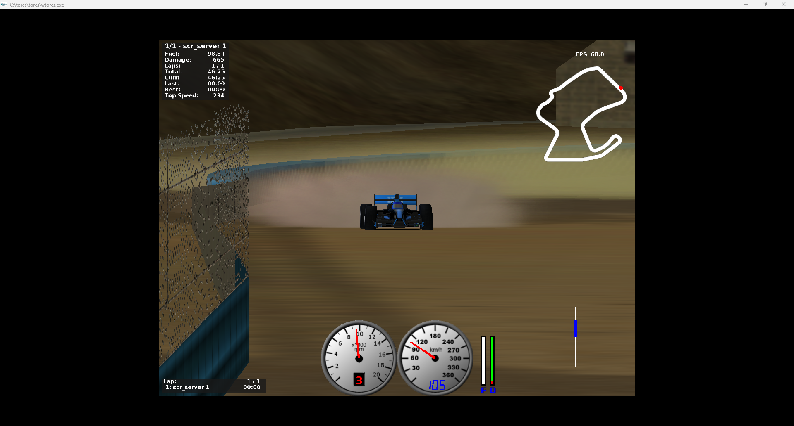

# 03 — Running our custom driver

How our Python controller talks to TORCS and drives a race.

**Prerequisites:** done `02-launching-torcs.md`.

**Status:** ✅ Architecture confirmed (2026-04-21) · ✅ **End-to-end smoke test passed (2026-04-21 AM)** · 🟡 `src/driver_baseline.py` to be written in Phase 2.

---

## The architecture (confirmed 2026-04-21)

TORCS itself is a C++ simulator. Our driver is **not** a C++ robot compiled into `drivers/`. Instead, the IBM bundle uses the **Simulated Car Racing (SCR)** architecture:

```
┌─────────────────────────┐      UDP :3001     ┌───────────────────────────┐
│ wtorcs.exe              │ <────────────────> │ Python client             │
│   + scr_server robot    │   sensors/actions  │ (our src/driver_baseline) │
│   (built into TORCS)    │   @ 50 Hz          │ via snakeoil3 protocol    │
└─────────────────────────┘                    └───────────────────────────┘
```

- **`scr_server`** is a built-in TORCS robot (ships with the IBM bundle). When configured as the race driver, it opens a UDP socket and **blocks waiting for a client**.
- **`snakeoil3_gym.py`** (in `C:\torcs\gym_torcs\`) is the Python client library. It handles UDP framing, sensor decoding, and action encoding.
- **Our code** imports/subclasses `snakeoil3` and implements the driving logic in a tick loop (~50 Hz).

### Why "Not Responding" is expected at launch

When you start TORCS with `scr_server` as the driver and **no Python client running**, the TORCS window shows `(Not Responding)` in the title bar. This is **not a crash** — `scr_server` is blocking on a `recvfrom()` UDP call. As soon as a Python client connects to port 3001, TORCS un-blocks and the race runs.

---

## Files in the bundle

| Path | Role |
|---|---|
| `C:\torcs\torcs\wtorcs.exe` | The simulator binary |
| `C:\torcs\gym_torcs\snakeoil3_gym.py` | UDP client library — **our driver imports from this** |
| `C:\torcs\gym_torcs\gym_torcs.py` | OpenAI Gym environment wrapper (optional — useful if we go RL) |
| `C:\torcs\gym_torcs\sample_agent.py` | Example Python driver — read this to learn the sensor/action protocol |
| `C:\torcs\gym_torcs\jmcncarai.py` | A more complex reference driver |
| `C:\torcs\gym_torcs\practice.xml` | Preconfigured race XML (Corkscrew + scr_server) |

---

## Verified dependencies (2026-04-21)

Minimum set required to run `snakeoil3_gym.py` against a live race:

| Component | Version | Notes |
|---|---|---|
| Python | **3.12.10** | Windows installer from python.org; ensure "Add to PATH" was checked |
| `gym` | **0.26.2** | `pip install gym==0.26.2` — pin avoids breaking API changes in 1.x; pulls `cloudpickle` + `gym_notices` as deps |
| `numpy` | any recent | Auto-installed with gym; tested with whatever pip resolves on 3.12 |

**Big finding:** `snakeoil3_gym.py` itself imports only **Python stdlib** (`socket`, `sys`, `getopt`, `os`, `time`). Confirmed by grepping imports at top of file. The standalone Phase 2 Day 1 smoke test therefore needs **nothing** beyond a vanilla Python install — `gym` is only required when we later use `gym_torcs.py` (the RL-env wrapper) or `sample_agent.py`.

This de-risks the smoke test: if `python snakeoil3_gym.py` fails, it's a TORCS-side or network-side issue, not a Python packaging issue.

---

## The two-process workflow

**Process 1 — TORCS:**

```
cd C:\torcs\torcs\
.\wtorcs.exe
```

In the TORCS menu: Race → Practice (or Quick Race) → Configure → select Corkscrew → Accept → New Race. Window shows "Not Responding" — correct. Leave it.

**Process 2 — Python client** (from a separate terminal):

```
cd C:\torcs\gym_torcs\
python snakeoil3_gym.py
```

As soon as this connects, TORCS un-blocks and the car starts driving (controlled by `snakeoil3`'s built-in demo steering).

### Smoke test verification (2026-04-21 AM)

This exact two-process workflow was run on the Windows dev machine (Python 3.12.10, `gym==0.26.2`, TORCS IBM Quick Start bundle). Results:

- Firewall prompt appeared once on first `python snakeoil3_gym.py` invocation — allowed for Private networks
- TORCS un-blocked within ~2 seconds of the client connecting
- Car drove around Corkscrew under snakeoil3's built-in demo controller
- HUD reported live physics (Top Speed 224 km/h)



**The demo controller steers poorly** — car wanders off the racing line and onto the gravel. This is expected: snakeoil3's demo is ~10 lines of naive heading-toward-middle logic, not a real driver. Replacing it with competent logic is exactly the scope of Phase 2 (`src/driver_baseline.py`).

**What this proves:**
- UDP handshake on port 3001 works
- Sensor data is flowing Python-ward at 50 Hz
- Action data (steer/accel/brake/gear) is flowing TORCS-ward and affecting physics
- No Python version / dep / firewall / OS issues remaining
- The stack we'll build `driver_baseline.py` on top of is sound

### Phase 2 targets

- `src/driver_baseline.py` — our own Python client that replaces `sample_agent.py`. Drives a clean Corkscrew lap using sensor-threshold rules (no LLM in the loop).
- `scripts/run_race.py` — full impl that starts TORCS, starts the Python client, archives the run per `telemetry/SCHEMA.md`.

---

## Running a race end-to-end (eventual Phase 2 shape)

```bash
# From the repo root
python scripts/run_race.py --driver baseline --track corkscrew --laps 1 --headless
```

`run_race.py` will orchestrate both processes, wait for the race to finish, invoke `validate_run.py`, and write the summary. See the skeleton in `scripts/run_race.py`.

---

## Exit criteria for a baseline run

Per roadmap Phase 2:

- [ ] Completes a clean Corkscrew lap (no crashes)
- [ ] Lap time recorded in `telemetry/baseline.md`
- [ ] 5-lap average stable (stddev under threshold TBD)
- [ ] Telemetry captured per `telemetry/SCHEMA.md` v0.2

---

## Next

- `04-capturing-telemetry.md` — the logging side; now clearer because we know sensors arrive via `snakeoil3.state` dict
- `05-granite-workflow.md` — Granite code-review loop while iterating on the driver
