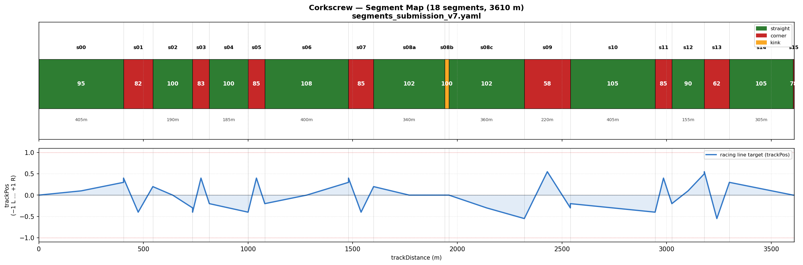

# Corkscrew — Track Map Reference

Linear reference for all 18 segments in submission config **v7**. Use segment IDs (`s00`–`s15`, with `s08` split into `s08a` / `s08b` / `s08c`) in tuning discussions, run reports, and commit messages.



*Top strip: segments colored by kind (green = straight, red = corner, yellow = kink), target speed in km/h printed inside each bar, length in meters below bars ≥150 m.*
*Bottom panel: racing-line target `trackPos` (−1 = left edge, 0 = center, +1 = right edge), interpolated from each segment's `entry_pos → apex_pos → exit_pos`.*

## Segment table (v7)

| # | id | kind | range (m) | length | target km/h | entry → apex → exit | notes |
|---|---|---|---|---|---|---|---|
| 0 | `s00_straight` | straight | 0–405 | 405 | 95 | 0.0 → 0.1 → 0.3 | start/finish straight |
| 1 | `s01_turn_L_475m` | corner L | 405–545 | 140 | 82 | 0.4 → −0.4 → 0.2 | first left |
| 2 | `s02_straight` | straight | 545–735 | 190 | 100 | 0.2 → 0.0 → −0.3 |  |
| 3 | `s03_turn_R_775m` | corner R | 735–815 | 80 | 83 | −0.4 → 0.4 → −0.2 |  |
| 4 | `s04_straight` | straight | 815–1000 | 185 | 100 | −0.2 → −0.3 → −0.4 |  |
| 5 | `s05_turn_R_1040m` | corner R | 1000–1080 | 80 | 85 | −0.4 → 0.4 → −0.2 |  |
| 6 | `s06_straight` | straight | 1080–1480 | 400 | 108 | −0.2 → 0.0 → 0.3 | longest clean straight |
| 7 | `s07_turn_L_1540m` | corner L | 1480–1600 | 120 | 85 | 0.4 → −0.4 → 0.2 |  |
| 8a | `s08a_straight` | straight | 1600–1940 | 340 | 102 | 0.2 → 0.0 → 0.0 | kink approach |
| 8b | `s08b_kink` | kink | 1940–1960 | 20 | 100 | 0.0 → 0.0 → 0.0 | ~20 m micro-zone |
| 8c | `s08c_straight` | straight | 1960–2320 | 360 | 102 | 0.0 → −0.3 → −0.55 | pre-hairpin setup |
| 9 | `s09_turn_R_2605m` | corner R | 2320–2540 | 220 | 58 | −0.55 → 0.55 → −0.3 | hairpin (outside-inside-outside) |
| 10 | `s10_straight` | straight | 2540–2945 | 405 | 105 | −0.2 → −0.3 → −0.4 |  |
| 11 | `s11_turn_R_2985m` | corner R | 2945–3025 | 80 | 85 | −0.4 → 0.4 → −0.2 |  |
| 12 | `s12_straight` | straight | 3025–3180 | 155 | 90 | −0.2 → 0.1 → 0.5 | short |
| 13 | `s13_turn_L_3272m` | corner L | 3180–3300 | 120 | 62 | 0.55 → −0.55 → 0.3 | second hairpin; tight on v6 |
| 14 | `s14_straight` | straight | 3300–3605 | 305 | 105 | — | last long straight |
| 15 | `s15_turn_L_3607m` | corner L | 3605–3610 | 5 | 78 | — | kink into start/finish |

## Mermaid overview (sequence)

```mermaid
flowchart LR
    s00["s00<br/>straight<br/>95"] --> s01["s01 L<br/>82"]
    s01 --> s02["s02<br/>100"]
    s02 --> s03["s03 R<br/>83"]
    s03 --> s04["s04<br/>100"]
    s04 --> s05["s05 R<br/>85"]
    s05 --> s06["s06<br/>108"]
    s06 --> s07["s07 L<br/>85"]
    s07 --> s08a["s08a<br/>102"]
    s08a --> s08b["s08b<br/>kink<br/>100"]
    s08b --> s08c["s08c<br/>102"]
    s08c --> s09["s09 R<br/>58<br/>hairpin"]
    s09 --> s10["s10<br/>105"]
    s10 --> s11["s11 R<br/>85"]
    s11 --> s12["s12<br/>90"]
    s12 --> s13["s13 L<br/>62<br/>hairpin"]
    s13 --> s14["s14<br/>105"]
    s14 --> s15["s15 L<br/>78"]
    s15 --> s00

    classDef straight fill:#2e7d32,color:#fff,stroke:#1b5e20
    classDef corner fill:#c62828,color:#fff,stroke:#8e0000
    classDef kink fill:#f9a825,color:#000,stroke:#c17900
    class s00,s02,s04,s06,s08a,s08c,s10,s12,s14 straight
    class s01,s03,s05,s07,s09,s11,s13,s15 corner
    class s08b kink
```



## How to regenerate

After any config update (vN+1), rerun the renderer:

```bash
python scripts/render_track_map.py --segments telemetry/segments_submission_v7.yaml
```

To compare two configs visually:

```bash
python scripts/render_track_map.py --segments telemetry/segments_submission_v6.yaml --out docs/track-map-v6.png
python scripts/render_track_map.py --segments telemetry/segments_submission_v7.yaml --out docs/track-map-v7.png
```

## Segment naming conventions

- Prefix `sNN` — segment index in lap order, zero-padded.
- `_straight` — cap-limited straight (lookahead throttle targets `target_speed_kmh`).
- `_turn_L_<dist>m` / `_turn_R_<dist>m` — numbered corner with approximate apex distance in meters.
- `_kink` — sub-5° deflection within an otherwise straight stretch.
- `s08` is split into `s08a` / `s08b` / `s08c` to isolate the 1940–1960 m kink from the long approach and exit.
